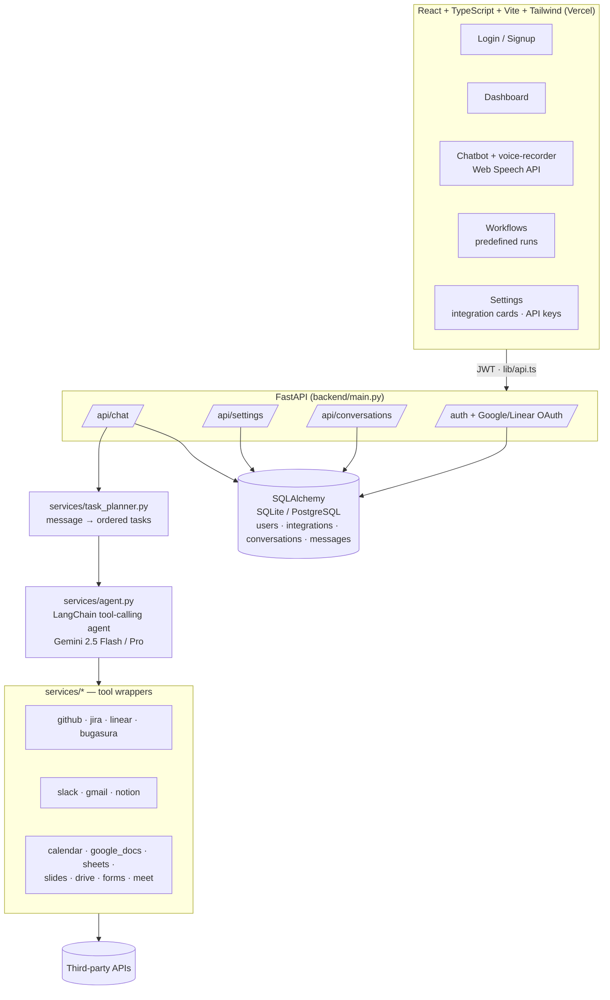

# WFLOW

**One natural-language command center for your work tools. Type or speak a request and an AI agent plans the steps and runs them across GitHub, Jira, Linear, Slack, Notion, Bugasura, Gmail and Google Workspace.**

For example: *"Create a Jira ticket for the login bug, post it in #eng on Slack and block 30 minutes tomorrow to fix it."* WFLOW's task planner splits the request into ordered sub-tasks, and a LangChain tool-calling agent on Gemini 2.5 carries each one out with the right integration. It reports per-task status and keeps the conversation for follow-ups.

---

## Features

- **Chat and voice:** type, or dictate through the browser Speech Recognition API
- **Multi-step task planning:** an LLM extracts individual tasks from one message and tracks each as `pending`, `in_progress`, `completed` or `failed`
- **About 15 tool integrations:** GitHub, Jira, Linear, Slack, Notion, Bugasura, Gmail, Google Calendar, Docs, Sheets, Slides, Drive, Forms and Meet
- **Predefined workflows:** Daily Standup Prep, Weekly Planning, Code Review Assistant, and a custom configuration
- **Dashboard and settings:** connect integrations with OAuth (Google, Linear) or API tokens, and bring your own Gemini key
- **Security:** bcrypt passwords, JWT sessions, and Fernet-encrypted integration tokens

## Architecture



## Getting started

### Backend

```bash
cd backend
python -m venv .venv && source .venv/bin/activate
pip install -r requirements.txt
cat > .env <<EOF2
DATABASE_URL=sqlite:///./conflux.db
GOOGLE_API_KEY=your-gemini-key
SECRET_KEY=change-me
ENCRYPTION_KEY=<fernet key>
EOF2
python migrate_db.py               # create / migrate tables
uvicorn main:app --reload          # http://localhost:8000/docs
```

### Frontend

```bash
npm install
npm run dev                        # http://localhost:5173
```

Set the API base URL in `src/lib/api.ts` if the backend isn't on the default host.

## Project structure

```
WFLOW/
├── src/
│   ├── pages/        # chatbot, dashboard, workflows, settings, signup
│   ├── ui/           # layout, sidebar, chat box, voice recorder, integration cards
│   ├── context/      # AuthContext
│   └── lib/api.ts    # API client
└── backend/
    ├── main.py       # FastAPI app
    ├── app/routers/  # auth, OAuth, chat, conversations, settings
    ├── app/services/ # agent, task planner, tool integrations
    └── Procfile      # deploy entry
```

## Tech stack

FastAPI · SQLAlchemy · LangChain · LangGraph · Google Gemini 2.5 · passlib/bcrypt · python-jose · cryptography · React · TypeScript · Vite · Tailwind CSS · Web Speech API · Vercel
